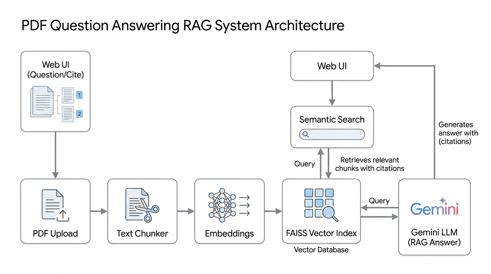

# PDF Question Answering Assistant

<p align="center">
  
</p>

A Retrieval Augmented Generation application that allows users to upload any PDF document and ask questions in plain English. The system finds relevant passages from the document and generates accurate answers with exact page citations.

**Quick Navigation**

[Overview](#overview) | [Features](#key-features) | [Tech Stack](#tech-stack) | [System Flow](#system-flow) | [Project Story](#project-story) | [Folder Structure](#folder-structure) | [Quick Start](#quick-start) | [API Reference](#api-reference)

## Overview

Reading large PDF files to locate specific answers takes time and effort. Standard AI chatbots can answer general questions, but they do not know the contents of private files and often create inaccurate information.

This project solves that problem by building a complete search and question answering pipeline. When a user uploads a PDF, the system extracts the text, breaks it into readable segments, creates vector representations, and uses similarity search to retrieve the exact pages containing the answer. The retrieved text is then passed to Google Gemini to produce a clear, factual answer.

## Key Features

* PDF Document Ingestion: Extracts clean text from single page or multi page documents while preserving page numbers.
* Smart Text Chunking: Segments long pages into overlapping passages so that sentence meaning is never cut in half.
* Dense Vector Search: Uses SentenceTransformers embeddings and FAISS index for subsecond similarity search.
* Citation Backed Answers: Every answer highlights exact source page numbers in brackets so users can verify facts.
* Fast Response Speed: Features an optimized pipeline providing answer generation in two to three seconds.
* Dual Service Architecture: Built with a FastAPI backend service and an interactive Streamlit web interface.

## Tech Stack

| Component | Technology |
|---|---|
| Web Interface | Streamlit |
| Backend API | FastAPI |
| Embedding Model | SentenceTransformers all MiniLM L6 v2 |
| Vector Database | FAISS Inner Product Index |
| Language Model | Google Gemini Flash Models |
| PDF Extraction | PyPDF |
| Server Runner | Uvicorn |
| Configuration | PyYAML and Python Dotenv |

## System Flow

1. Upload: User selects and uploads a PDF file through the web browser.
2. Ingestion: PyPDF reads the file page by page and cleans unnecessary whitespace.
3. Segmentation: Text chunker splits the text into passages of 1000 characters with 150 character overlap.
4. Embedding: The embedding model converts each text passage into a 384 dimensional numerical vector.
5. Storage: Vectors are stored inside a FAISS index for rapid cosine similarity matching.
6. Query Search: When the user asks a question, the question is converted into a vector and matched against stored passages.
7. Answer Synthesis: The most relevant passages and user question are passed to Google Gemini to formulate the answer.
8. Output: The web interface displays the answer, page citations, and response timing.

## Project Story

### Situation
Many organizations and students work with long research papers, technical manuals, and resumes in PDF format. Searching through these files manually is slow, while standard language models frequently fabricate facts when asked about documents they have not seen.

### Task
Design and implement a clean, modular Retrieval Augmented Generation system that allows anyone to upload a PDF and get reliable, citation backed answers without hallucinations.

### Action
1. Structured the project into independent modules for ingestion, chunking, embeddings, vector database, retrieval, prompts, LLM client, and API routes.
2. Implemented page number tracking during text extraction so that every chunk knows its original page source.
3. Built dense vector indexing using FAISS with L2 normalization for accurate cosine similarity retrieval.
4. Created structured prompt templates that instruct the language model to answer strictly from retrieved context and declare when information is missing.
5. Integrated fast Google Gemini Flash models with automatic model fallback to avoid rate limits and minimize latency.
6. Connected the FastAPI backend to an intuitive Streamlit chat interface.

### Result
The application processes documents in under one second and returns accurate, citation referenced answers in two to three seconds, giving users verifiable facts from their documents.

## Folder Structure

```
rag_project/
  README.md
  requirements.txt
  .env
  .env.example
  .gitignore
  config.yaml
  main.py
  assets/
    rag_flow_diagram.jpg
  src/
    __init__.py
    ingestion/
      __init__.py
      loader.py
    chunking/
      __init__.py
      chunker.py
    embeddings/
      __init__.py
      embedder.py
    vectordb/
      __init__.py
      vector_store.py
    retrieval/
      __init__.py
      retriever.py
    prompts/
      __init__.py
      prompt_templates.py
    llm/
      __init__.py
      llm_client.py
    api/
      __init__.py
      routes.py
    utils/
      __init__.py
      helpers.py
  frontend/
    app.py
  tests/
    __init__.py
    test_app.py
  logs/
    app.log
```

## Quick Start

### Prerequisites
* Python 3.8 or higher installed on your computer
* Google Gemini API key from Google AI Studio

### 1. Clone the Repository
```bash
git clone https://github.com/vidhyawalke/RAG-PDF-Assistant.git
cd RAG-PDF-Assistant
```

### 2. Create and Activate Virtual Environment
```bash
python -m venv venv
```

On Windows:
```bash
venv\Scripts\activate
```

On Linux or macOS:
```bash
source venv/bin/activate
```

### 3. Install Dependencies
```bash
pip install -r requirements.txt
```

### 4. Set Environment Variables
Copy `.env.example` to `.env` and add your API key:
```env
GOOGLE_API_KEY=your_gemini_api_key_here
```

### 5. Start the Application

Start the FastAPI backend service:
```bash
python main.py
```
Backend API documentation is available at `http://localhost:8001/docs`

Start the Streamlit user interface in another terminal:
```bash
streamlit run frontend/app.py --server.port 8000
```
Open your browser and navigate to `http://localhost:8000`

## API Reference

| Endpoint | Method | Description |
|---|---|---|
| `/` | GET | Returns service welcome message and documentation links |
| `/health` | GET | Returns operational health and vector store readiness |
| `/upload` | POST | Ingests PDF file, segments text, and builds vector index |
| `/ask` | POST | Retrieves relevant passages and generates grounded answer |

## Running Tests

Run the automated test suite with Python unittest:
```bash
python -m unittest tests/test_app.py
```

