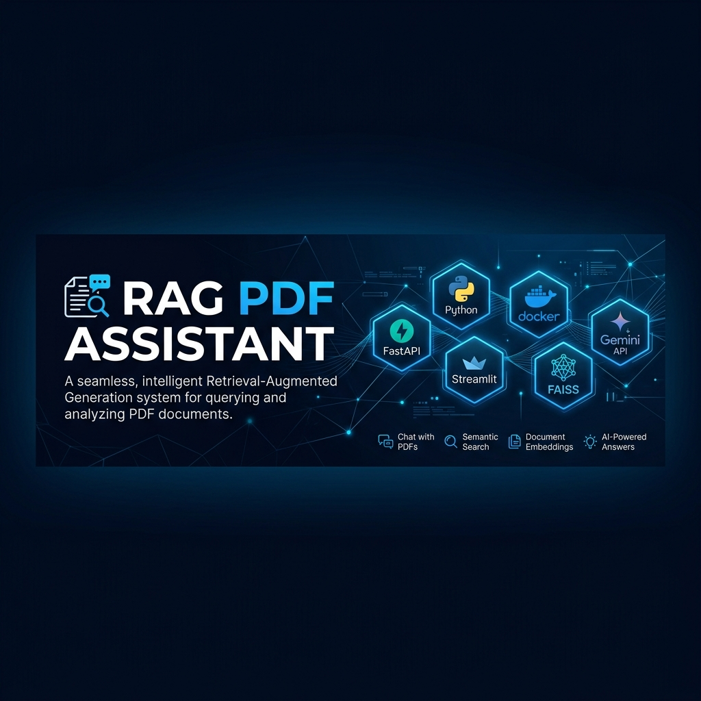

# RAG PDF Assistant — AI Document Q&A Engine

<p align="center">
  
</p>

A Retrieval-Augmented Generation (RAG) system built with **FastAPI**, **Streamlit**, **FAISS**, and **Google Gemini API**. It processes any uploaded PDF document, indexes text passages into dense vector embeddings, and provides accurate, grounded answers with exact page citations and execution latency metrics.

---

## Tech Stack

| Layer | Technology |
|---|---|
| **Frontend** | Streamlit UI |
| **Backend** | FastAPI (Python 3.10) |
| **AI Engine** | Google Gemini API (`gemini-3.6-flash`, `gemini-3.5-flash`) |
| **Embeddings** | SentenceTransformers (`all-MiniLM-L6-v2`) / TF-IDF Fallback |
| **Vector DB** | FAISS (`IndexFlatIP` normalized cosine search) |
| **PDF Extraction** | PyPDF |
| **Container & Deployment** | Docker, Supervisor, Docker Compose & Render |

---

## Scope & Target Use Cases

AskPDF is designed to make working with dense, complex PDFs effortless by enabling users to query documents conversationally. It works seamlessly for **any PDF document**:

* **Students & Researchers** — Quickly extract methodologies, findings, and citations from academic papers.
* **Professionals & Analysts** — Search technical manuals, financial disclosures, contracts, and specifications.
* **Engineers & Developers** — Query product documentation, specifications, and architecture papers.

---

## Key Features

* **Universal PDF Upload**: Drag and drop any PDF file. Extracts text, tracks 1-indexed page metadata, and builds overlapping text chunks (1000 characters, 150 overlap).
* **Dense FAISS Vector Indexing**: Converts text chunks into 384-dimensional dense vectors stored in a FAISS inner-product index for fast context retrieval.
* **Grounded AI Synthesis**: Uses Google Gemini API with system prompts requiring structured Markdown output grounded strictly in retrieved context.
* **Transparent Page Citations**: Every response includes expandable source drawers with matching text snippets and exact page numbers.
* **Interactive UI & Performance Metrics**: Real-time response timing badges, dark mode support, and session history management.

---

## How It Works

1. **Upload PDF**: User uploads a document via the sidebar interface.
2. **Text Ingestion & Chunking**: PyPDF extracts text page-by-page and splits it into overlapping passages with page metadata.
3. **Vector Embedding**: SentenceTransformers (`all-MiniLM-L6-v2`) computes dense vector embeddings and populates the FAISS index.
4. **Context Retrieval**: On user question, vector search retrieves top-3 context passages (`[Page X]`).
5. **Grounded Generation**: Gemini API generates a structured, context-grounded answer with source citations.

---

## Setup & Running Locally

### 1. Clone & Install Dependencies

```bash
git clone https://github.com/vidhyawalke/RAG-PDF-Assistant.git
cd RAG-PDF-Assistant

python -m venv venv
# Windows:
venv\Scripts\activate
# Linux/macOS:
source venv/bin/activate

pip install -r requirements.txt
```

### 2. Configure Environment Variables

Copy `.env.example` to `.env` and set your Google Gemini API key (get a free key from [Google AI Studio](https://aistudio.google.com/)):

```env
GOOGLE_API_KEY=your_actual_gemini_api_key
```

### 3. Launch Application

* **Streamlit Web UI**: `streamlit run frontend/app.py --server.port 8000` (open http://localhost:8000)
* **FastAPI Backend API**: `uvicorn backend.main:app --port 8001 --reload` (open http://localhost:8001/docs)
* **Docker Compose**: `docker-compose up --build`

---

## Deployment Configuration

The application is configured for single-container Docker deployment on platforms like **Render**:
* **Streamlit UI** listens on dynamic `$PORT` (default `8000`) on `0.0.0.0`.
* **FastAPI Backend** runs internally on port `8001` on `127.0.0.1`.
* Managed by **Supervisor** in a `python:3.10-slim` container.
